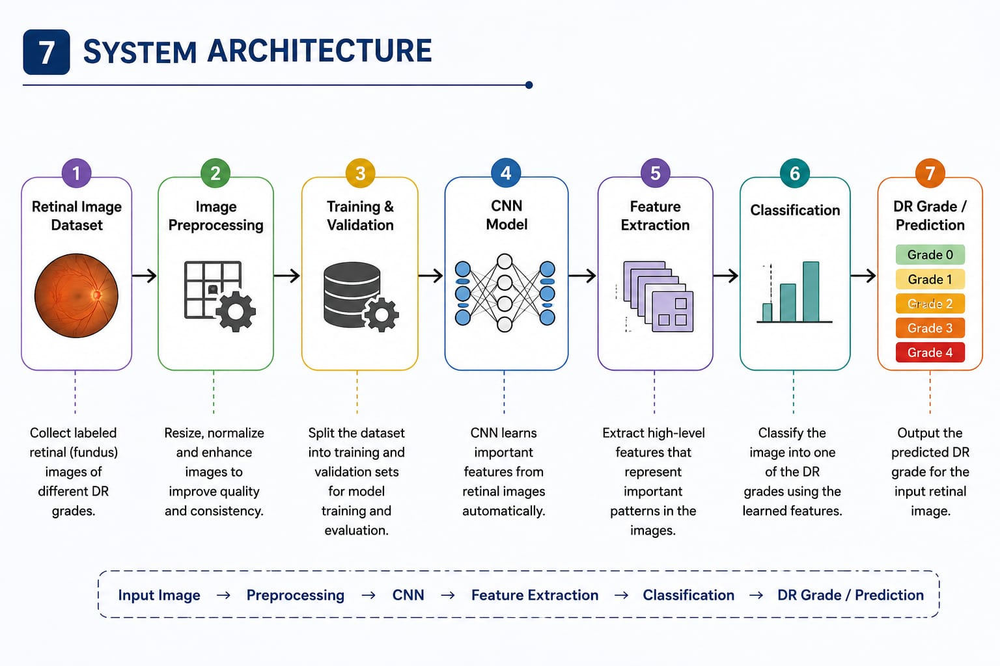
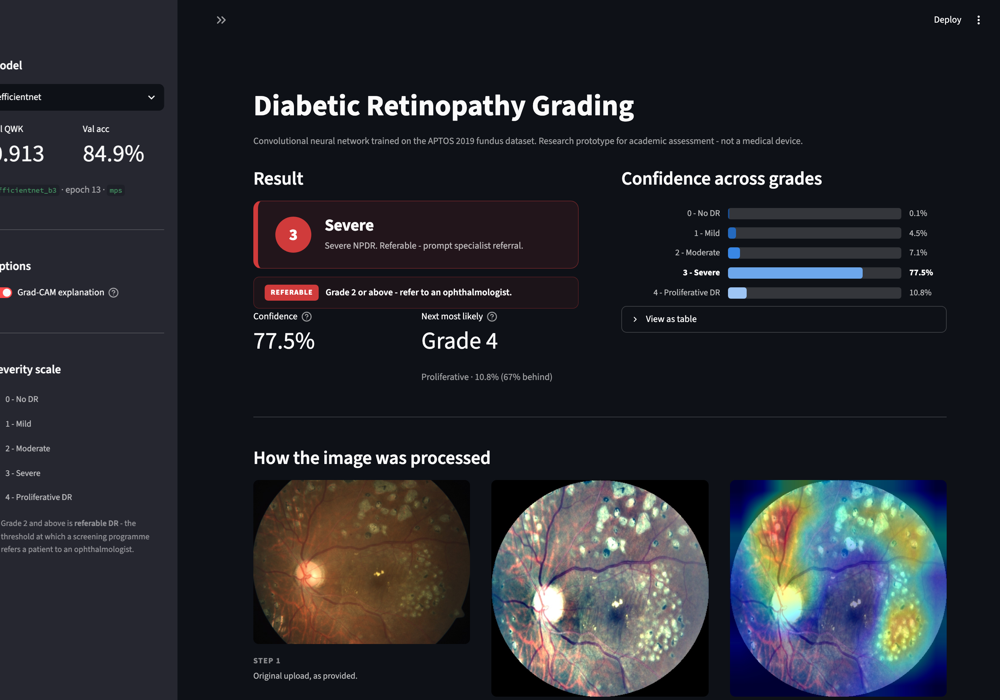

# Automated Detection and Grading of Diabetic Retinopathy Using CNN

Final year project. A convolutional neural network that reads a colour retinal
fundus photograph and assigns an international-standard diabetic retinopathy
severity grade from 0 to 4, with a Grad-CAM heatmap explaining each decision.



## The seven stages

| # | Stage | Where it lives |
|---|-------|----------------|
| 1 | Retinal image dataset | `src/download_data.py` |
| 2 | Image preprocessing | `src/preprocess.py` |
| 3 | Training / validation split | `src/preprocess.py` (`build_splits`) |
| 4 | CNN model | `src/models.py` |
| 5 | Feature extraction | `src/models.py` (backbone) |
| 6 | Classification | `src/models.py` (head), `src/engine.py` |
| 7 | DR grade / prediction | `src/predict.py`, `app/app.py` |

## Grading scale

| Grade | Meaning | Clinical action |
|-------|---------|-----------------|
| 0 | No DR | Routine annual screening |
| 1 | Mild NPDR | Re-screen in 12 months |
| 2 | Moderate NPDR | **Referable** - ophthalmologist review |
| 3 | Severe NPDR | **Referable** - prompt referral |
| 4 | Proliferative DR | **Urgent** referral |

Grades 2 and above are "referable DR", the binary decision a screening
programme actually acts on. Sensitivity on that split is reported alongside
the five-class metrics.

## Dataset

[APTOS 2019 Blindness Detection](https://www.kaggle.com/competitions/aptos2019-blindness-detection)
- 3,662 labelled fundus photographs from Aravind Eye Hospital, India.

Grade distribution is heavily imbalanced, which is why class weighting and QWK
matter more than raw accuracy here:

| Grade | 0 | 1 | 2 | 3 | 4 |
|-------|---|---|---|---|---|
| Images | 1,805 | 370 | 999 | 193 | 295 |
| Share | 49.3% | 10.1% | 27.3% | 5.3% | 8.1% |

The original competition blocks all downloads until you accept its rules in a
browser. `download_data.py` therefore defaults to a complete mirror of the same
3,662 images (`mariaherrerot/aptos2019`) that needs only a logged-in CLI. The
script verifies the grade counts against the official distribution either way.

## Quick start - just run the demo

You do **not** need the 8 GB dataset to try the model. Clone, install, pull the
trained weights, and run:

**macOS / Linux**

```bash
git clone https://github.com/ns8963038-hub/Automated-Detection-and-Grading-of-Type-1-Diabetic-Retinopathy.git
cd Automated-Detection-and-Grading-of-Type-1-Diabetic-Retinopathy
python3 -m venv .venv && source .venv/bin/activate
pip install -r requirements.txt
python -m src.download_weights
streamlit run app/app.py
```

**Windows (PowerShell)**

```powershell
git clone https://github.com/ns8963038-hub/Automated-Detection-and-Grading-of-Type-1-Diabetic-Retinopathy.git
cd Automated-Detection-and-Grading-of-Type-1-Diabetic-Retinopathy
py -m venv .venv
.venv\Scripts\activate
pip install -r requirements.txt
python -m src.download_weights
streamlit run app/app.py
```

No Git installed? Use the green **Code -> Download ZIP** button instead of
`git clone`, then `cd` into the extracted folder. Run `dir` (Windows) or `ls`
and confirm you see `README.md` and `src` before continuing - if the download
or clone failed, every later command fails in a way that points at the wrong
problem.

Full Windows instructions, including the CUDA build and common errors:
**[docs/SETUP_WINDOWS.md](docs/SETUP_WINDOWS.md)**.



### Launching it again later

Once set up, the venv, weights and dataset all persist. To run it again:

```powershell
cd <project folder>
.venv\Scripts\activate      # macOS/Linux: source .venv/bin/activate
streamlit run app/app.py
```

Or just double-click **`run_app.bat`** (Windows) or **`run_app.command`**
(macOS). Both change to their own directory first, so they work wherever the
project folder lives, and they fetch the weights if those are missing.

### What each task needs

| Goal | Dataset (8 GB) | Weights (60 MB) |
|------|----------------|-----------------|
| Run the demo on your own images | no | yes |
| Reproduce the reported test metrics | yes | yes |
| Retrain from scratch | yes | no |

Trained weights are published as
[release assets](https://github.com/ns8963038-hub/Automated-Detection-and-Grading-of-Type-1-Diabetic-Retinopathy/releases/tag/v1.0)
rather than committed, so clones stay small. `python -m src.download_weights`
fetches them into `outputs/models/`.

## Full setup (for training)

```bash
python3 -m venv .venv
source .venv/bin/activate
pip install -r requirements.txt
kaggle auth login                    # one-time browser login
```

## Pipeline

```bash
# 1. Download (~8.6 GB)
python -m src.download_data

# 2. Preprocess and build the stratified 70/15/15 split
python -m src.preprocess

# 3. Train
python -m src.train --model baseline       # from-scratch CNN
python -m src.train --model efficientnet   # transfer learning

# 4. Evaluate on the held-out test split
python -m src.evaluate --model efficientnet

# 5. Demo
streamlit run app/app.py
```

Quick end-to-end smoke test before committing to a full run:

```bash
python -m src.train --model efficientnet --epochs 2 --limit 64
```

## Preprocessing

Fundus images arrive at different resolutions, aspect ratios and exposures
because they come from several camera models and clinics. Stage 2 normalises
this:

1. **Black border crop** - trims the uninformative frame around the retina.
2. **Square resize** to 456px, cached to disk so training never re-decodes.
3. **Ben Graham enhancement** - subtracts a heavily Gaussian-blurred copy of
   the image from itself. Removing the low-frequency component cancels
   per-camera colour cast and uneven illumination, leaving microaneurysms,
   haemorrhages and exudates clearly visible. This is the highest-impact
   single step for this dataset.
4. **Circular mask** - zeroes the corners outside the retinal field of view so
   the network cannot key on camera-specific corner artefacts.

## Data quality: duplicates and label noise

Hashing every preprocessed image surfaced two problems in APTOS 2019 itself,
both of which are worth stating rather than hiding.

**Duplicate photographs.** 3,662 rows contain only 3,534 unique images: 128
rows are exact pixel duplicates of another row under a different `id_code`,
spread over 123 groups (largest group: 4 copies). Under a naive per-row split,
copies of one photograph can land in both train and test, so those test rows
are not really held out.

**Conflicting labels.** 30 of those duplicate groups are graded
*differently* in different rows - the identical image is labelled, say, both
grade 1 and grade 2. That is irreducible label noise, and it puts a ceiling on
achievable accuracy.

### Measured impact

Under the original per-row split, 28 of 550 test images (5.1%) had an
identical copy somewhere in train. Removing them changes the result as
follows:

| Test subset | Accuracy | QWK |
|---|---|---|
| All 550 (reported) | 0.8255 | 0.9005 |
| Clean 522 (leaked removed) | 0.8276 | 0.9031 |
| The 28 leaked rows alone | 0.7857 | 0.7635 |

The leakage did **not** inflate the headline number - removing it makes the
score slightly *better*. The duplicated rows are harder than average precisely
because they are the ones carrying conflicting labels, so the model receives
contradictory supervision on them.

### Fix

`build_splits` now splits on **image content hash** rather than on row, so
every copy of a photograph is forced into a single split. It asserts the
guarantee afterwards rather than trusting it. Pass `--no-group-split` to
reproduce the old per-row behaviour.

```bash
python -m src.preprocess --force-split    # regenerate a group-aware split
```

Regenerating the split changes which images are in test, so the numbers above
would need a retrain to stay consistent. They are reported here against the
original split, with the leakage measured and disclosed.

## Models

| Key | Architecture | Input | Purpose |
|-----|--------------|-------|---------|
| `baseline` | 5-block VGG-style CNN, ~4.9M params | 224px | From-scratch reference point |
| `efficientnet` | EfficientNet-B3, ImageNet-pretrained | 300px | Main model |
| `resnet` | ResNet-50, ImageNet-pretrained | 300px | Comparison row |

Training uses AdamW, cosine decay with a 2-epoch linear warmup, class-weighted
cross-entropy with label smoothing, gradient clipping, and early stopping on
validation QWK.

### Measured training cost

Benchmarked on an Apple M5 (16 GB) using the Metal (MPS) backend, 2,563
training images:

| Model | s/step | images/s | min/epoch | Configured epochs | Total |
|-------|--------|----------|-----------|-------------------|-------|
| `baseline` | 0.33 | 96.9 | 0.4 | 40 | ~17 min |
| `efficientnet` | 0.72 | 22.1 | 1.9 | 25 | ~48 min |
| `resnet` | 0.55 | 29.1 | 1.5 | 25 | ~37 min |

Early stopping (patience 8 on validation QWK) usually ends runs sooner. The
whole baseline + EfficientNet comparison trains in about an hour, so no GPU
rental is needed.

## Ablations

Two components are swappable from the command line, so the report can measure
these choices instead of asserting them. They do different jobs and every run
uses one of each:

| Component | What it is | Options |
|---|---|---|
| **Activation** | The non-linearity *inside* the network. Without one, stacked convolutions collapse into a single linear operation. | `relu` (default), `leaky_relu`, `gelu`, `silu`, `elu`, `mish` |
| **Optimizer** | The rule that turns gradients *into* weight updates. | `adamw` (default), `adam`, `sgd`, `rmsprop` |

```bash
# single run
python -m src.train --model baseline --optimizer sgd --activation gelu

# full sweeps -> outputs/logs/ablation_*.csv|md
python -m src.ablation --sweep optimizer  --epochs 15
python -m src.ablation --sweep activation --epochs 15
```

Sweeps use the `baseline` model because it is the only one trained from
scratch. Pretrained backbones ship with their own activations - EfficientNet
uses **SiLU** (Swish), ResNet uses **ReLU** - and replacing those would
invalidate the ImageNet weights they were trained with.

Default runs are named after the model (`baseline_best.pt`); any non-default
combination gets a suffix (`baseline_sgd_gelu_best.pt`), so sweeps never
overwrite each other. Architecture and activation are stored in the
checkpoint, so evaluation and the demo app reload any run correctly.

## Reproducibility

`src/utils.py:set_seed` seeds Python, numpy and torch, and every DataLoader is
built with an explicit generator plus a `worker_init_fn`. Albumentations 2.x
keeps its own RNG *inside* the Compose object, which is copied into each
worker process, so the worker init also reseeds that per worker - otherwise
all workers emit the identical augmentation stream while still differing
between runs.

Verified: two runs with the same seed produce byte-identical augmented
tensors; different seeds differ; successive samples within a run still vary.

Note that MPS kernels are not bit-deterministic, so final metrics can differ
in the last decimal place across runs even with identical seeds.

## Metrics

**Quadratic weighted kappa** is the headline number and the official APTOS
metric. Unlike accuracy it penalises a grade 0 -> 4 error far more than a
grade 3 -> 4 error, matching how a clinician judges mistakes. Also reported:
accuracy, macro/weighted F1, per-class precision and recall, the confusion
matrix, and referable-DR sensitivity and specificity.

## Results

Measured on the held-out test split (550 images), which no training or model
selection ever touched.

| Model | Params | Epochs | Time | Accuracy | **QWK** | Macro F1 | Referable sens. |
|-------|--------|--------|------|----------|---------|----------|-----------------|
| **EfficientNet-B3** | 10.7M | 21 | 46 min | **0.8255** | **0.9005** | 0.6769 | **0.9193** |
| Baseline CNN (scratch) | 4.9M | 40 | 22 min | 0.7818 | 0.8706 | 0.6298 | 0.8969 |

Transfer learning is worth **+0.030 QWK and +4.4pp accuracy**, and reaches the
baseline's best score in 4 epochs rather than 32.

### Per-class (EfficientNet-B3)

| Grade | Precision | Recall | F1 | n |
|-------|-----------|--------|-----|---|
| 0 - No DR | 0.996 | 0.978 | 0.987 | 271 |
| 1 - Mild | 0.614 | 0.625 | 0.619 | 56 |
| 2 - Moderate | 0.747 | 0.787 | 0.766 | 150 |
| 3 - Severe | 0.366 | 0.517 | 0.429 | 29 |
| 4 - Proliferative | 0.750 | 0.477 | 0.583 | 44 |

Three things worth stating plainly rather than glossing over:

**No sight-threatening case was called healthy.** Zero grade-3 and grade-4
images were predicted as grade 0. Almost every error is an adjacent-grade
confusion, which is also where human graders disagree most.

**Grades 3 and 4 are the weak point** (F1 0.43 and 0.58). They have only 193
and 295 images in the whole dataset, so this is a data limitation rather than
a modelling failure. Collecting more severe cases is the single highest-value
next step.

**Macro F1 (0.68) is far below accuracy (0.83)** because macro F1 weights all
five grades equally while accuracy is flattered by grade 0 being half the
data. This is exactly why QWK, not accuracy, is the headline metric.

### Validation loss rose while QWK improved

Between epochs 10 and 13 the validation *loss* increased while validation
*QWK* improved to its best value. Both are correct: cross-entropy punishes
overconfidence, whereas QWK only measures whether the predicted grade lands in
the right place on the ordinal scale. Checkpointing on `qwk` rather than
`val_loss` is what preserved the best model - early stopping on loss would
have frozen it at epoch 6.

## Explainability

`src/gradcam.py` implements Grad-CAM against the last convolutional feature
map. It turns "the model says grade 3" into "the model says grade 3 because of
these lesions", which is what makes the output defensible to a clinician and
is the most convincing thing to show in a demo.

## What drove a prediction

Grad-CAM says *where* the network looked. `src/lesions.py` addresses *what is
there*, by detecting the features the international grading scale is actually
built on and measuring how concentrated each one is inside the attended
region.

| Feature | Why it matters clinically |
|---------|---------------------------|
| **Microaneurysms / haemorrhages** | Earliest and most decisive sign of DR; their number and spread drive grades 1-3 |
| **Hard exudates** | Yellow lipid deposits from leaking capillaries; near the macula they threaten vision directly |
| **Vasculature** | Detected to keep vessels out of the red-lesion mask, and drawn for orientation |

Detection is classical image processing, run on the *original* image rather
than the preprocessed one - the Ben Graham step recentres every image on
mid-grey, destroying the hue difference between yellow exudates and red
haemorrhages that the detectors depend on. The optic disc is masked out of
both detectors; it is naturally bright and yellow and would otherwise dominate
the exudate count on every image.

The reported multiplier is an **enrichment ratio**: lesion density inside the
most-attended quarter of the retina, divided by density across the whole
retina. A ratio rather than a raw overlap, because a heatmap covering a
quarter of the image would otherwise appear to "explain" everything simply by
being large. `2.0x` means twice as dense in the attended region as elsewhere.

### Validation

Detector output across 12 test images per grade, showing the counts rise with
severity as they should:

| Grade | Exudate count | Red lesions (% area) | Red lesion count |
|-------|---------------|----------------------|------------------|
| 0 | 4.5 | 0.036 | 6.1 |
| 1 | 5.9 | 0.090 | 12.0 |
| 2 | 8.8 | 0.117 | 11.6 |
| 3 | 6.9 | 0.192 | 16.3 |
| 4 | 9.1 | 0.213 | 16.1 |

Red lesion area rises **5.9x** from grade 0 to grade 4 and is monotonic across
all five grades - exactly the criterion the clinical scale is built on.

Red lesions are accepted or rejected per connected component rather than per
pixel. Two earlier pixel-wise steps were measurably harmful: a 3x3
morphological opening erased roughly 40% of candidates, since a microaneurysm
is only 3-8 px across; and deleting vessel pixels from the mask fragmented
shapes, once turning 23 blobs into 57. Judging whole components also allows
the property that actually separates lesions from vessels - lesions are
compact and roughly round, vessel fragments are elongated. The change raised
grade-0-to-4 separation from 2.8x to 5.9x while leaving the grade 0 baseline
low.

### What this does not prove

APTOS 2019 carries **image-level grades only, with no lesion annotations**, so
none of these are trained detectors and none of this is a readout of the
model's reasoning. It is a *correlation* between independently detected
lesions and where the network looked.

A high multiplier is evidence the model attended to clinically meaningful
structures. A low one means either the detectors missed something or the model
used features they cannot see - subtle texture, colour or vessel calibre. Both
happen in the test set, and the app reports the sparse case explicitly rather
than inventing an explanation. Training a genuine lesion detector would need a
pixel-annotated dataset such as IDRiD.

## Project layout

```
src/
  config.py           all hyperparameters and paths
  utils.py            seeding and reproducibility helpers
  download_data.py    stage 1
  download_weights.py fetch trained checkpoints from the release
  preprocess.py       stage 2 + 3
  dataset.py          Dataset, augmentations, class weights
  models.py           stages 4/5/6
  engine.py           train/eval loops, metrics
  train.py            training entry point
  evaluate.py         test-set metrics and figures
  compare.py          model comparison table and figure
  ablation.py         optimizer / activation sweeps
  eda.py              dataset-chapter figures
  gradcam.py          Grad-CAM: where the model looked
  lesions.py          what is there: lesion detection + enrichment
  predict.py          single-image inference
app/app.py            Streamlit demo
docs/SETUP_WINDOWS.md Windows setup guide
outputs/              figures and metrics (weights via release)
```

## Disclaimer

Research prototype for academic assessment. Not a medical device and not
validated for clinical use.
